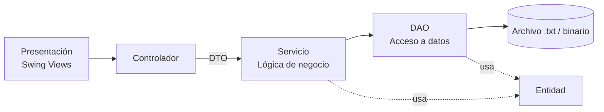
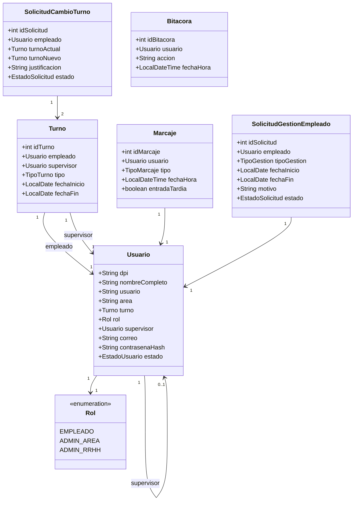
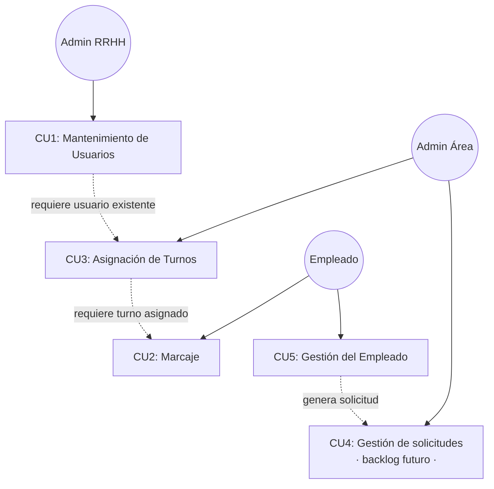
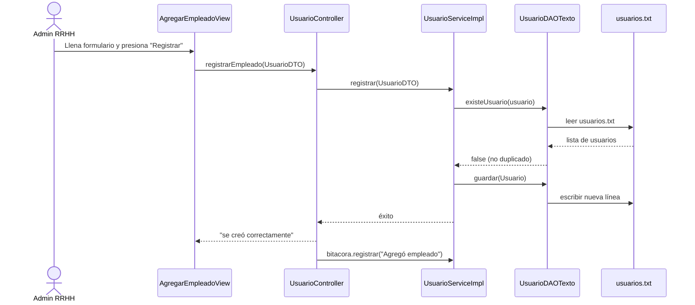
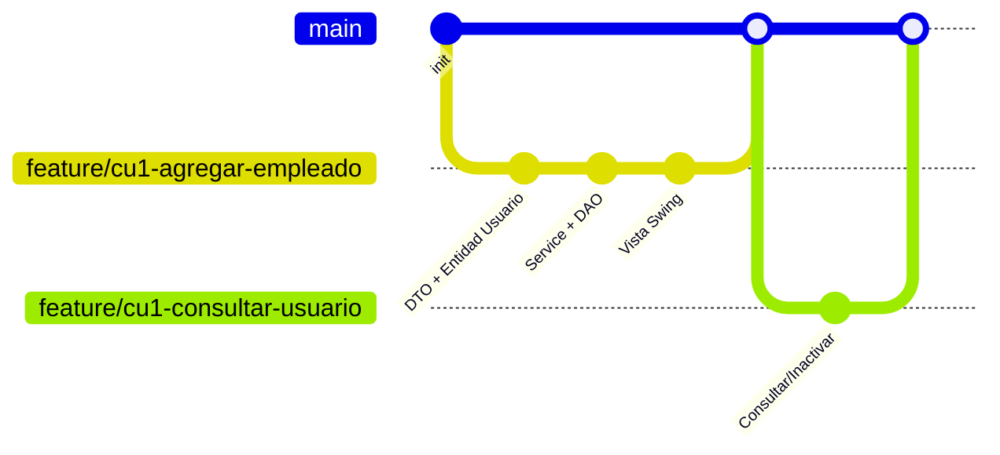

# Documentación Técnica — Sistema Control de Turnos

## 1. Contexto y restricciones técnicas

- **Lenguaje:** Java 1.8.0_231
- **Interfaz gráfica:** `javax.swing`
- **Persistencia:** archivo de texto (`.txt`) o binario — sin motor de base de datos ni frameworks
- **Alcance de esta entrega:** CU1 (Mantenimiento de Usuarios), CU3 (Asignación de Turnos), CU2 (Marcaje), CU5 (Gestión del Empleado). CU4 (Gestión de solicitudes) queda para una iteración posterior (ver `Backlog_Scrum.md`).

---

## 2. Arquitectura en capas

El sistema sigue una arquitectura en capas basada en patrones del catálogo *Core J2EE Patterns* (DAO, Transfer Object) y *Service Layer* (Fowler), adaptada a una app de escritorio sin frameworks:



| Capa | Responsabilidad | No debe hacer |
|---|---|---|
| Presentación | Capturar datos del usuario, mostrar resultados/mensajes | Validar reglas de negocio |
| Controlador | Recibir eventos de la Vista, armar el DTO, llamar al Servicio | Contener lógica de negocio |
| DTO | Transportar datos entre Controlador y Servicio | Tener lógica o persistencia |
| Servicio | Aplicar reglas de negocio (RN01, RN02, ...), orquestar el DAO | Saber cómo se guarda el archivo |
| DAO | Leer/escribir el archivo, convertir a/desde Entidad | Validar reglas de negocio |
| Entidad | Representar el registro persistente | Tener lógica de presentación |

---

## 3. Principios SOLID aplicados

| Principio | Aplicación concreta en este proyecto |
|---|---|
| **S**ingle Responsibility | `UsuarioService` solo valida reglas de usuario; `UsuarioDAO` solo lee/escribe el archivo; el Controlador solo orquesta. |
| **O**pen/Closed | Interfaces `IUsuarioService` / `IUsuarioDAO` permiten agregar `UsuarioDAOBinario` sin modificar el Servicio ni el Controlador. |
| **L**iskov Substitution | Cualquier implementación de `IUsuarioDAO` (txt, binario) debe comportarse igual ante los mismos casos (ej. "no encontrado" siempre devuelve lo mismo). |
| **I**nterface Segregation | Una interfaz por entidad (`IUsuarioDAO`, `ISolicitudDAO`, `IBitacoraDAO`) en vez de una interfaz gigante compartida. |
| **D**ependency Inversion | El Controlador depende de `IUsuarioService`, no de `UsuarioServiceImpl`; el "cableado" (quién instancia qué) se hace en un solo lugar (`Main` o una clase `AppConfig`). |

---

## 4. Estructura de paquetes

```
SistemaControlTurnos/
├── src/com/controlturnos/
│   ├── Main.java
│   ├── presentacion/       # Vistas Swing (JFrame/JPanel/JDialog)
│   ├── controlador/        # Orquestan Vista <-> Servicio (usan DTO)
│   ├── dto/                # Objetos de transporte Controlador -> Servicio
│   ├── servicio/           # Interfaces + impl/ (lógica de negocio)
│   ├── dao/                # Interfaces + impl/ (acceso a archivo)
│   ├── entidad/             # Modelo de datos persistente
│   └── util/                # ManejadorArchivos, Constantes, Validaciones
└── data/
    ├── usuarios.txt
    ├── turnos.txt
    ├── marcajes.txt
    ├── solicitudes.txt
    └── bitacora.txt
```

---

## 5. Diagrama de clases — Entidades principales



---

## 6. Diagrama de casos de uso



---

## 7. Diagrama de secuencia — Ejemplo: Agregar Empleado (CU1)



---

## 8. Git Workflow — GitHub Flow

Se usa **GitHub Flow** (no Git Flow) por la escala del proyecto: sin releases paralelos, sin necesidad de ramas de hotfix.

- `main`: siempre debe compilar y reflejar lo último terminado.
- Una rama por historia de usuario: `feature/cu1-agregar-empleado`, `feature/cu3-asignar-turno`, etc.
- Al terminar y probar la historia, merge (o Pull Request) a `main`.
- Al final de cada día del plan de sprints, `main` refleja el incremento entregado.



---

## 9. Estrategia de persistencia (archivo de texto)

Formato propuesto por línea, delimitado por `|` (fácil de parsear con `String.split("\\|")`):

```
# usuarios.txt
dpi|nombreCompleto|usuario|area|turno|rol|supervisorUsuario|correo|contrasenaHash|estado
0002312365478|Wendy Abigail Garcia Lopez|Wendy|Ventas|MATUTINO|EMPLEADO|Adonias|wendy@gmail.com|$2a$10$...|ACTIVO
```

El `ManejadorArchivos` (capa `util`) centraliza la lectura/escritura línea por línea, y cada DAO concreto (`UsuarioDAOTexto`, `TurnoDAOTexto`, etc.) se encarga de convertir esas líneas a/desde su Entidad correspondiente — así, si más adelante cambian a binario o a una base de datos real, solo se reemplaza la implementación del DAO (ver sección 3, Open/Closed y Dependency Inversion).
